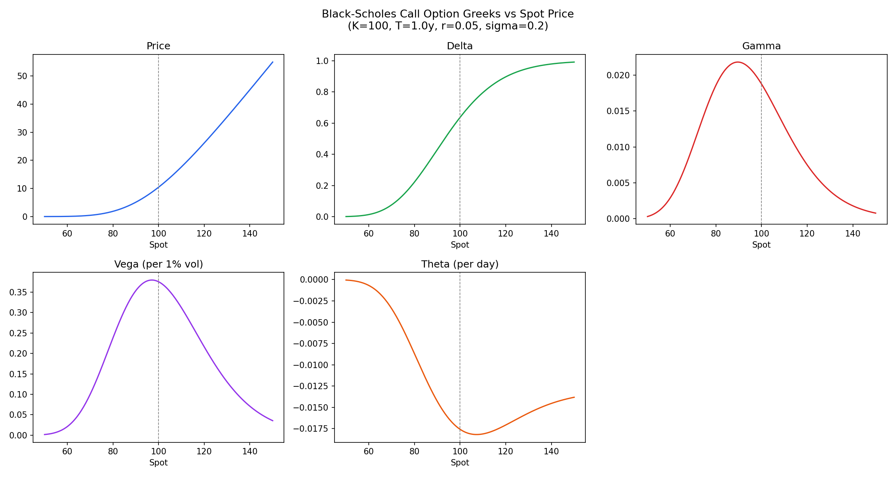
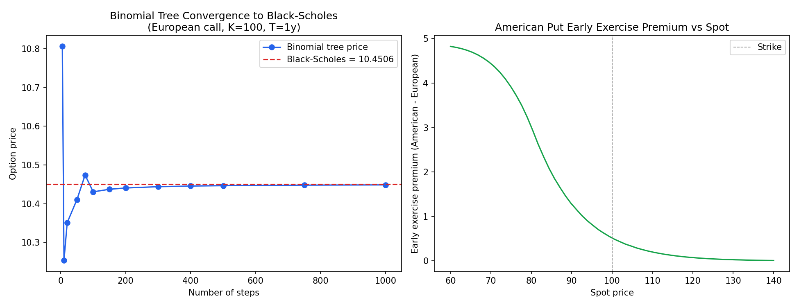
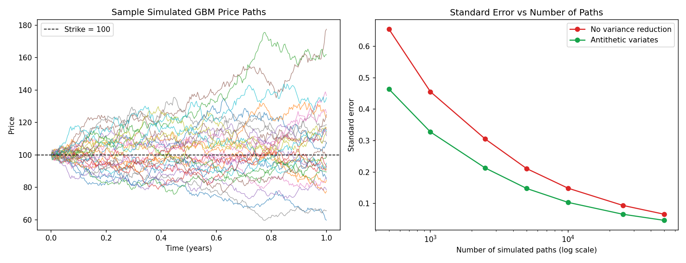
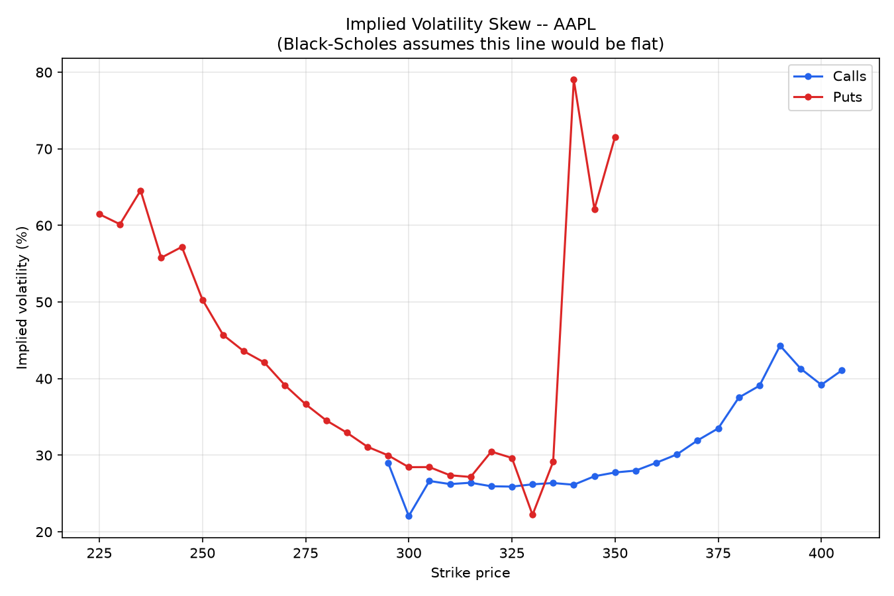

# Options Pricing Models

Implementation of European option pricing under the Black-Scholes framework,
with the Greeks and visualizations. Part of a broader quant portfolio
(alongside a backtested trading strategy and a risk modeling / VaR project).

## What's in here

- **Black-Scholes closed-form pricer** for European calls and puts
- **Full set of Greeks**: delta, gamma, vega, theta, rho
- **Unit tests** validating against known reference values and put-call parity
- **Visualization** of how each Greek behaves across spot price
- **Binomial tree (CRR)** pricer supporting both European and American exercise
- **Convergence analysis** showing the tree converging to Black-Scholes as steps increase, plus the early exercise premium for American puts
- **Monte Carlo pricer** using simulated GBM paths, with antithetic variates for variance reduction
- **Asian (path-dependent) option** pricing, which neither Black-Scholes nor the binomial tree can handle directly
- **Real market comparison**: pulls a live option chain (Yahoo Finance), backs out implied volatility per strike, and plots the volatility skew against the Black-Scholes flat-vol assumption

This project is complete as a portfolio piece. Possible extensions: local
volatility / SABR models, or a Greeks-based hedging simulation.

## Example

```python
from models.black_scholes import BlackScholes

call = BlackScholes(S=100, K=100, T=1, r=0.05, sigma=0.2, option_type="call")
print(call.summary())
# {'price': 10.4506, 'delta': 0.6368, 'gamma': 0.0188, 'vega': 0.3752, 'theta': -0.0176, 'rho': 0.5323}
```

## Greeks vs Spot Price



Gamma and vega peak near the strike (as expected — that's where the option's
value is most sensitive to small moves). Delta transitions smoothly from 0
(deep OTM) to 1 (deep ITM). Theta decay is steepest near-the-money, since
that's where time value is greatest.

## Binomial Tree: American vs European

```python
from models.binomial_tree import BinomialTree

am_put = BinomialTree(S=100, K=100, T=1, r=0.05, sigma=0.2, steps=500,
                       option_type="put", exercise="american")
eu_put = BinomialTree(S=100, K=100, T=1, r=0.05, sigma=0.2, steps=500,
                       option_type="put", exercise="european")

print(am_put.price(), eu_put.price())
# 6.0888 5.5695 -- the ~$0.52 gap is the early exercise premium
```

For calls with no dividends, American and European prices are effectively
identical, since early exercise is never optimal in that case — the model
reproduces this correctly.



The left chart shows the tree price converging to the Black-Scholes value as
the number of steps increases (the oscillation at low step counts is a known
characteristic of the CRR tree, not a bug). The right chart shows the early
exercise premium for an American put across spot prices — largest deep
in-the-money, decaying to zero out-of-the-money.

## Monte Carlo Pricing & Variance Reduction

```python
from models.monte_carlo import MonteCarloOptionPricer

mc = MonteCarloOptionPricer(S=100, K=100, T=1, r=0.05, sigma=0.2,
                             option_type="call", n_paths=50_000, antithetic=True)
price, std_err = mc.price_european()
# price ~ 10.43, matches Black-Scholes' 10.4506 within statistical error
```

**Variance reduction (antithetic variates):** for every random path generated,
a mirrored path is also generated using the negated random draws. Averaging
paired paths cancels out some sampling noise, meaningfully reducing the
standard error for the same number of simulated draws — i.e. more accuracy
for the same compute.



The left chart shows sample simulated price paths under GBM. The right chart
is the key result: standard error consistently drops when using antithetic
variates, across every sample size tested.

**Asian options:** the pricer also handles path-dependent Asian options,
where the payoff depends on the *average* price over the option's life
rather than just the terminal price. This is a case Black-Scholes and the
binomial tree can't price directly. As expected, the Asian call is cheaper
than the equivalent European call, since averaging dampens the effect of
volatility on the payoff.

## Real Market Comparison & Implied Volatility Skew

Black-Scholes assumes constant volatility across all strikes. Real markets
don't behave that way: out-of-the-money puts are typically priced with
higher implied volatility than at-the-money options, reflecting how the
market prices downside/crash risk. This is the "volatility skew," and
plotting it is one of the clearest ways to show where a theoretical model
departs from reality.

```bash
# Fetch a live option chain and back out implied vol per strike
python models/market_comparison.py --ticker AAPL

# Plot the skew from the saved data
python notebooks/plot_vol_skew.py --ticker AAPL
```



This is real AAPL option chain data. Implied volatility is lowest near the
money (around the $300-330 strikes, close to the $316.83 spot price at the
time) and rises on both wings — a "volatility smile" with a stronger skew
on the downside. The steeper rise on the put side reflects that the market
prices downside protection more expensively than equivalent upside
exposure, which a constant-volatility model like Black-Scholes cannot
capture on its own.

The implied volatility solver uses Brent's method to find the volatility
that makes the Black-Scholes price match the observed market price. It's
validated with synthetic data: price an option at a known volatility, solve
for it, and confirm we recover the same number (see
`tests/test_market_comparison.py`). The live data fetch also filters out
illiquid/stale quotes (wide spreads, deep OTM strikes, near-zero prices) to
avoid noisy or nonsensical implied vols.

Note: this part requires live internet access to Yahoo Finance and is meant
to be run locally rather than regenerated automatically, since option chains
change constantly and depend on market hours.

## Running it

```bash
pip install -r requirements.txt

# Run the pricer directly
python models/black_scholes.py

# Run tests
python tests/test_black_scholes.py

# Regenerate the plots
python notebooks/plot_greeks.py
python notebooks/plot_convergence.py
python notebooks/plot_monte_carlo.py
```

## Validation

The model is checked against known textbook values (Hull, *Options, Futures
and Other Derivatives*) and against put-call parity:

```
C - P = S - K * e^(-rT)
```

All 7 Black-Scholes tests pass (`tests/test_black_scholes.py`), all 6
binomial tree tests pass (`tests/test_binomial_tree.py`), all 6 Monte Carlo
tests pass (`tests/test_monte_carlo.py`), and all 4 implied volatility
solver tests pass (`tests/test_market_comparison.py`) — including a check
that the solver exactly recovers a known volatility from a synthetically
generated price, and correctly returns NaN for prices with no valid
implied vol.

## Project structure

```
options-pricing/
├── models/
│   ├── black_scholes.py       # Closed-form pricing model + Greeks
│   ├── binomial_tree.py       # CRR tree, European + American exercise
│   ├── monte_carlo.py         # GBM simulation, antithetic variates, Asian options
│   └── market_comparison.py   # Live option chain fetch + implied vol solver
├── tests/
│   ├── test_black_scholes.py  # Unit tests
│   ├── test_binomial_tree.py  # Unit tests
│   ├── test_monte_carlo.py    # Unit tests
│   └── test_market_comparison.py  # Unit tests (synthetic data validation)
├── notebooks/
│   ├── plot_greeks.py         # Greeks visualization script
│   ├── greeks_vs_spot.png     # Generated chart
│   ├── plot_convergence.py    # Convergence visualization script
│   ├── binomial_convergence.png  # Generated chart
│   ├── plot_monte_carlo.py    # Monte Carlo visualization script
│   ├── monte_carlo_paths.png  # Generated chart
│   └── plot_vol_skew.py       # Implied vol skew plotting script (run after market_comparison.py)
├── data/                      # (reserved for market data comparison, next step)
├── requirements.txt
└── README.md
```
